# Map Editor - MOOB

> Author: [@dtoxftw](https://github.com/dtoxftw)

Hello! I just wanted to make a quick n dirty write-up about how to use the editor in its current (very early) state. Keep in mind that since this is not the official release, it can be a bit finicky at times. But it’s fun to play around with for now. So ENJOY!!  I've also included the heightmap I'm using so you can play around with it as well.

If you want to work with heightmaps you will need to install **BepInEx** and the **MOOB** mod via thunderstore: https://thunderstore.io/c/cities-skylines-ii/ 

To get started open up the devui and go to **UI Bindings**, scroll down to **menu** and select **startEditor**. 

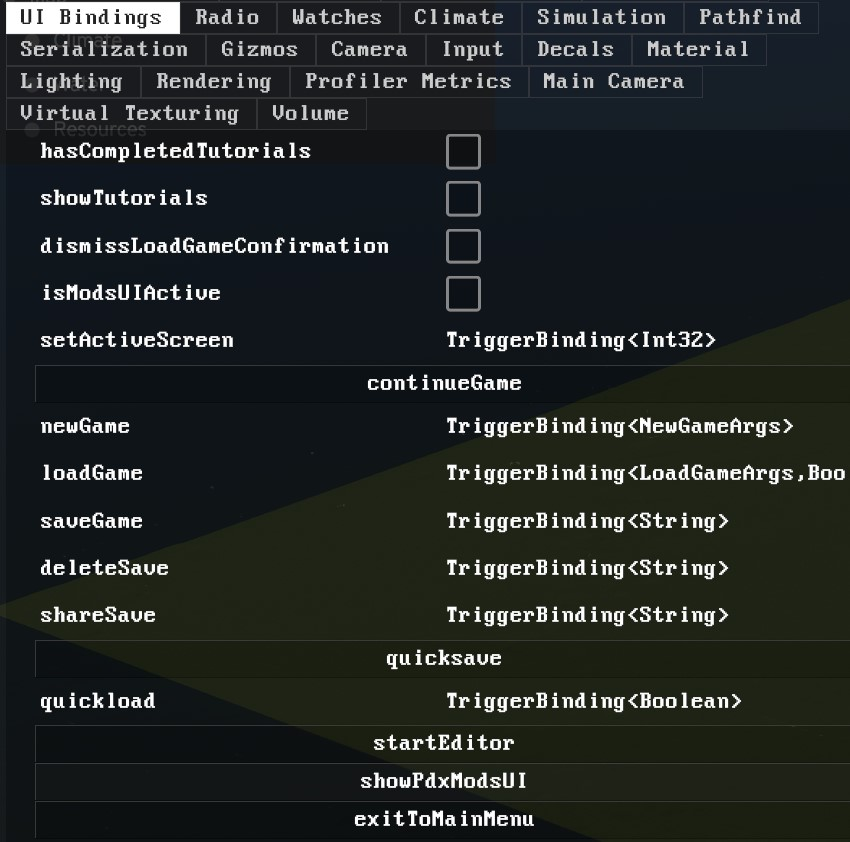

If your terrain is brown and water is filled with poo, go into **Simulation** in the devui and hit **Load game**.

This essentially resets everything and your terrain/water should now look normal.

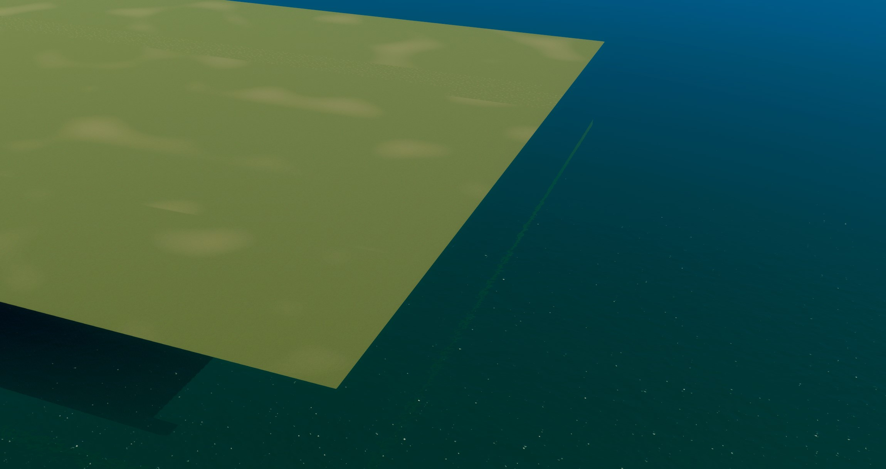

Prepping heightmaps:  your heightmap should be grayscale 4096 x 4096 16bit in .RAW format. (.PNG support is coming soon) Note: the importer flips and rotates the heightmap. Before you export your map, be sure to flip and rotate 90 degrees. 

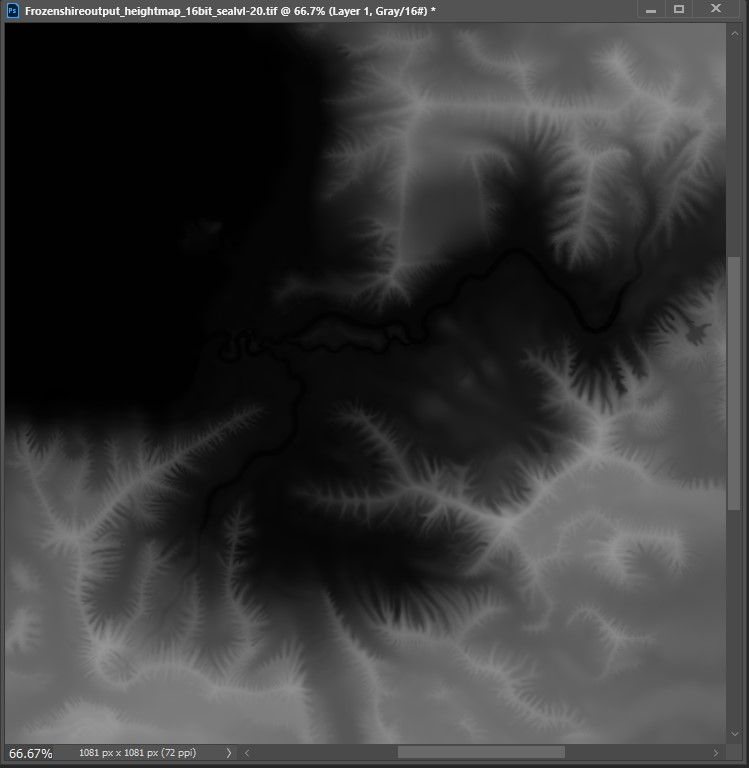

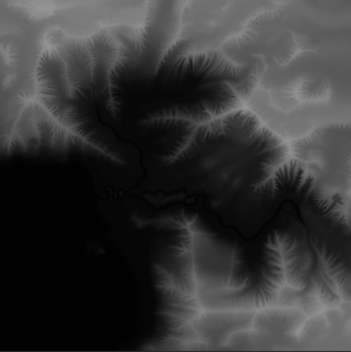

-----

Also, if using Photoshop to export RAW, be sure to check IBM instead of Macintosh.

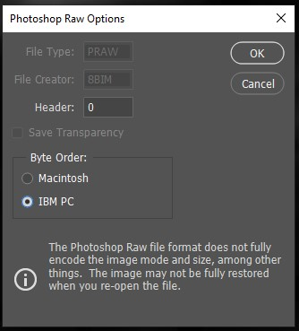

**Here is the .RAW file I’m using.  It's from the Snowfall DLC in CS1 (Frozenshire)**

[Download "Frozenshire_heightmap.raw" - 32MB](./images/Forzenshire_heightmap.raw)

Click on the **shovel icon** in the lower-mid of the screen. On the bottom-right you will see the button for **Importing Heightmaps**. Simply navigate to your file and select it. Your map should now look like this:

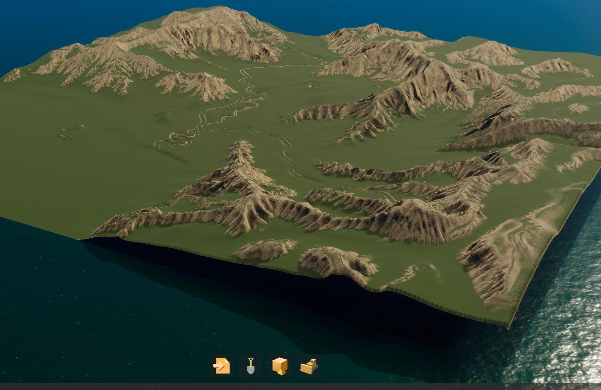

This is where the fun begins (not really.)  WATER!!! The water is incredibly slow so to help it along we need to go into **Simulation - water** and change the **water sim speed** to 64x (or max.)

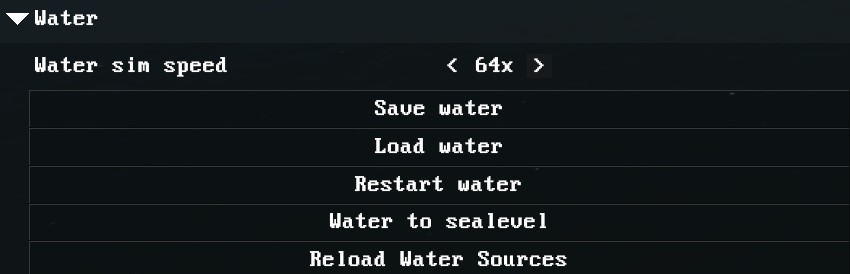

On the top left is the **Workspace** tab (close devui if you have it open.) Click on **Water** and you’ll see options pop up on the top right.  Add a **Border Sea Water Source** and drop down its menu for settings. Make the source something large like a **Radius** of 3000 and then move it to the corner of the map. (**Position** -7000, 7000)

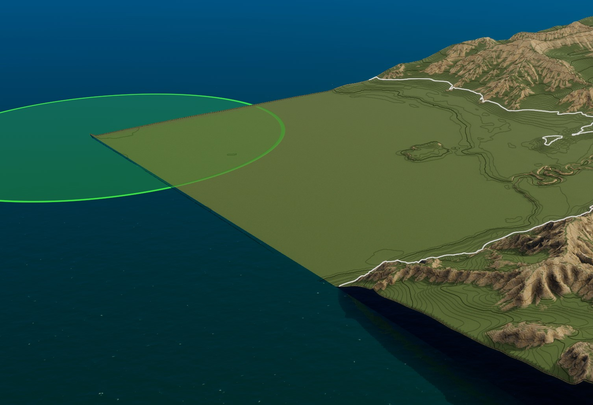

Once the placement is correct you can then define the **Height**. 50 seems to work well on this map. (If you are using a different map, you will have to play around to find what’s best for you.) Once you type in 50, the map will begin to flood. **THIS WILL TAKE A LONG TIME**. Even with the sim speed turned up. It just depends on your hardware. For example: on my machine (13700k)  this map took 30 min to finally fill the rivers. Grab a snack lol

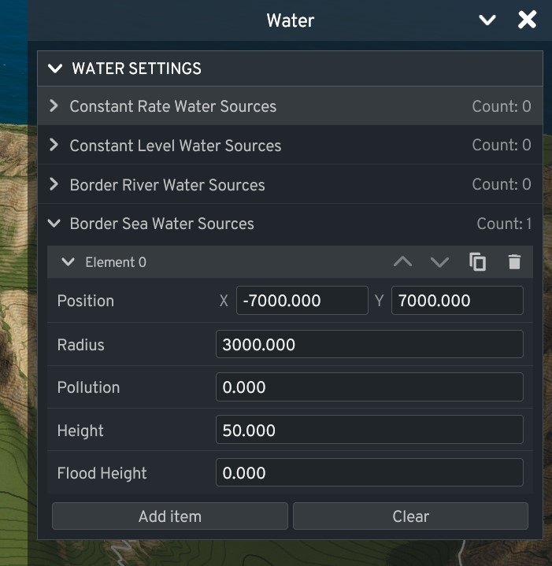

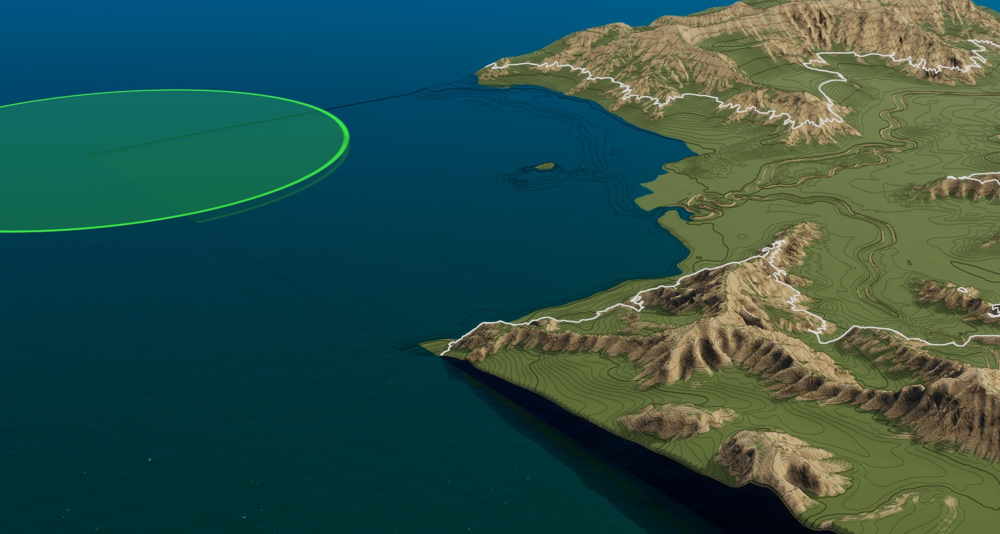

Make sure you are happy with the water height before you get too deep into terraforming or adding trees/roads/etc. If you are happy with it, go ham!  Play around with the brushes, there are even a couple mountain brushes.

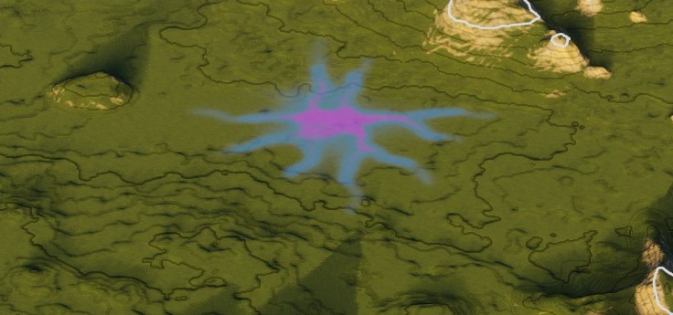

Saving: again go to the **Workspace** panel (top left) and click on **Map**. On the right you will see options that define your map. Give it a name and, at the bottom, hit **Save Map**. Now give your map a **File Name** and hit **Save**.

Your map will now be available when you start a new game along with the vanilla maps. The actual map  location is **C:\Users\USERNAME\AppData\LocalLow\Colossal Order\Cities Skylines II\Maps**

I am still pretty new to the editor but it took us a while to figure these simple things out, so I hope this helps. If you have any info to add, by all means share!

ENJOY!

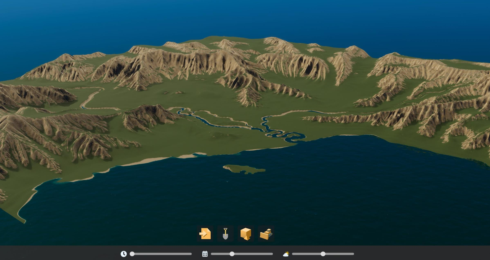